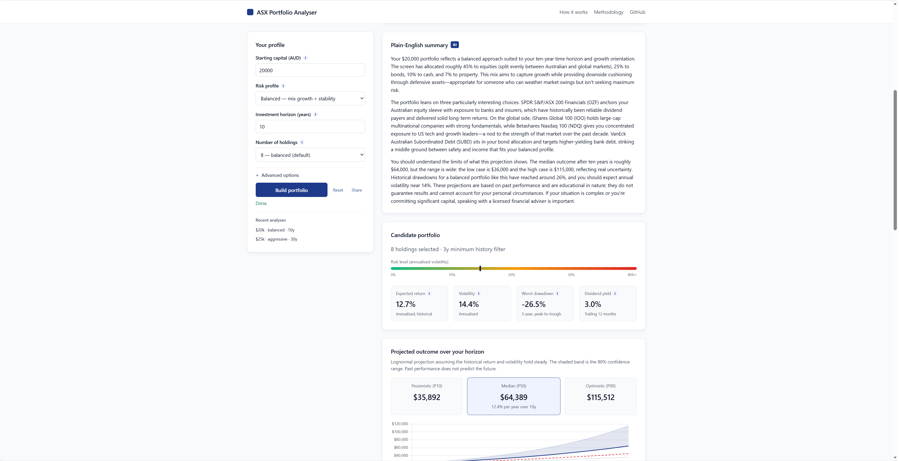
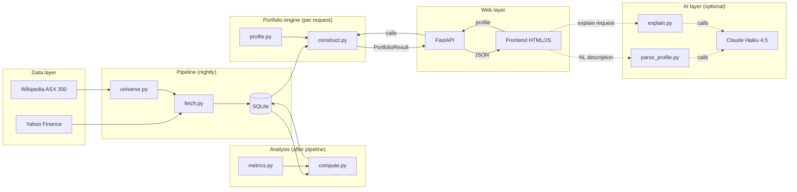
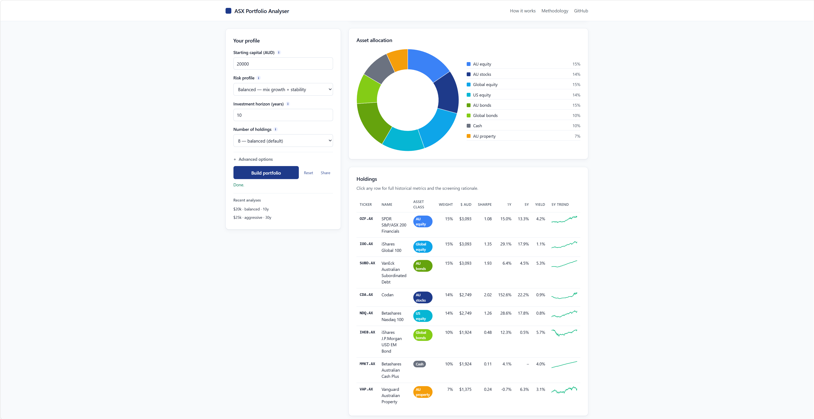
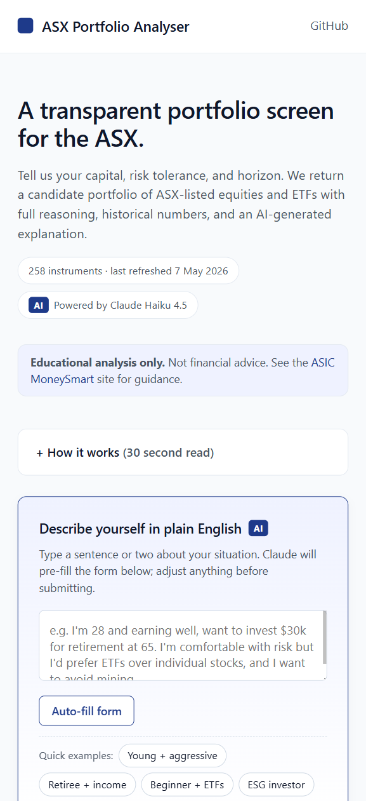

# ASX Portfolio Analyser

> An educational portfolio-analysis tool for ASX-listed equities and ETFs. Users describe their starting capital, risk tolerance, investment horizon and preferences in plain English; the tool returns a candidate portfolio with transparent reasoning, historical risk/return characteristics, AI-generated explanations, and a horizon-based projection.

**🌐 Live demo: [asx-portfolio-analyser.onrender.com](https://asx-portfolio-analyser.onrender.com)** &nbsp;·&nbsp; the first request after a quiet period takes ~15 seconds (free-tier cold start).



> [!WARNING]
> **Educational analysis only.** This project does **not** constitute personal financial advice under the Australian *Corporations Act 2001*. No individual circumstances have been considered. Anyone making investment decisions should consult an AFSL-licensed adviser and consult [ASIC's MoneySmart](https://moneysmart.gov.au/).

---

## What this project demonstrates

A self-contained, end-to-end data product that exercises the full data-analyst stack:

- **Data engineering** — automated nightly pipeline pulling 10 years of daily OHLCV, dividends, and corporate-action data for the S&P/ASX 300 plus a curated list of ~50 popular ASX-listed ETFs (~325 instruments, ~575 000 price rows).
- **Quantitative analysis** — for each instrument: annualised return (1y/3y/5y/10y), volatility, Sharpe ratio, maximum drawdown, beta vs STW.AX, dividend yield. All edge cases handled: insufficient history returns `None` rather than fabricating numbers.
- **Portfolio construction** — a two-stage rules-based + risk-parity hybrid. Risk profile + horizon + tilts produce a target asset allocation; within each sleeve, instruments are ranked by Sharpe, screened, and inverse-volatility weighted.
- **Projections** — lognormal-returns model giving an 80% confidence band on the final portfolio value at the user's horizon.
- **AI integration** — Claude Haiku 4.5 used in two places: (1) free-text user descriptions parsed into structured profile fields via tool use; (2) plain-English summaries of the candidate portfolio.
- **Web layer** — FastAPI backend, single-page frontend with no framework, Chart.js for visualisation, ~700 lines of HTML/CSS/JS.

## Architecture



Solid arrows are the deterministic core. Dashed arrows are optional AI augmentations. The portfolio engine works without the AI layer.

## Tech stack

| Layer | Technology | Why |
|---|---|---|
| Data ingestion | `yfinance`, `requests`, `pandas` | Free, reliable, no API keys |
| Storage | SQLite | Zero-config, single file, fast for this size |
| Analysis | `pandas`, `numpy` | Industry standard; vectorised |
| Portfolio | Pure Python + `pandas` | Transparent, no opaque solvers |
| API | FastAPI + Pydantic | Auto OpenAPI docs, fast, type-safe |
| Frontend | Vanilla HTML/CSS/JS + Chart.js | No framework lock-in, no build step |
| AI | Anthropic Claude Haiku 4.5 (tool use) | Cheap, structured output, fast |

## Quick start

```bash
# Clone and enter
git clone https://github.com/ArlenChijian/asx-portfolio-analyser.git
cd asx-portfolio-analyser

# Set up Python env
python -m venv venv
venv\Scripts\activate                 # Windows; use 'source venv/bin/activate' on macOS/Linux
pip install -r requirements.txt

# Pull data (~15 min) and compute metrics (~10 sec)
python -m pipeline.run_pipeline
python -m analysis.run_analysis

# Optional — enable AI features by adding your key to .env
echo ANTHROPIC_API_KEY=sk-ant-... > .env

# Run the web app
uvicorn web.server:app --reload --port 8000
# Open http://127.0.0.1:8000
```

## Project structure

```
.
├── pipeline/             Data ingestion (Wikipedia + Yahoo Finance -> SQLite)
│   ├── universe.py         Defines what we track (ASX 300 + curated ETFs)
│   ├── fetch.py            Pulls prices, dividends, metadata
│   ├── storage.py          SQLite schema + read/write helpers
│   └── run_pipeline.py     Orchestrator script
├── analysis/             Per-instrument analytics
│   ├── metrics.py          Pure math: returns, volatility, Sharpe, drawdown, beta
│   ├── compute.py          Reads prices, runs metrics, writes back
│   └── run_analysis.py     Orchestrator script
├── portfolio/            Portfolio construction
│   ├── profile.py          UserProfile + risk-profile target allocations
│   ├── construct.py        Sleeve-based screen + inverse-vol weighting
│   └── run_portfolio.py    CLI for testing
├── ai/                   Optional AI augmentations
│   ├── client.py           Anthropic client setup; reads .env
│   ├── parse_profile.py    Free-text -> structured profile (tool use)
│   └── explain.py          PortfolioResult -> plain-English summary
├── web/                  HTTP layer
│   ├── server.py           FastAPI endpoints
│   └── static/             index.html, style.css, app.js
├── docs/
│   └── METHODOLOGY.md      Deep dive on every design decision
└── requirements.txt
```

## Screenshots

The asset allocation, holdings table with sparklines and asset-class colour coding, and detail-on-click rationale:



Mobile layout — sticky header, dataset-freshness pill, AI quick-fill chips:



## How it works (in 60 seconds)

1. The **pipeline** scrapes the current S&P/ASX 300 list from Wikipedia and combines it with a curated list of ~50 popular ASX-listed ETFs. For each ticker, it pulls 10 years of daily prices, dividends, and metadata from Yahoo Finance, storing everything in a SQLite database.

2. The **analysis** layer computes 12 metrics per instrument: annualised returns over four windows (1/3/5/10y), volatility over two windows (1y/3y), Sharpe over two windows, max drawdown, beta versus the ASX 200 (proxied by STW.AX), and trailing dividend yield.

3. The **portfolio engine** takes a `UserProfile` (capital, risk profile, horizon, plus 12 optional preferences) and produces a candidate portfolio. Risk profile + horizon + geographic tilt determine the target asset allocation across 12 asset classes. The user's `max_holdings` budget is distributed across sleeves proportionally to target weight. Within each sleeve, instruments are screened (ETFs-only, ESG, sector includes/excludes, ticker excludes, min yield, max vol, min history) and ranked by Sharpe; the top N are inverse-volatility weighted. A 10% (configurable) per-position cap is enforced iteratively. The lognormal projection uses the weighted-average expected return + volatility against the user's horizon.

4. The **AI layer** is two cheap Claude Haiku calls: a free-text → structured-profile parser using tool use, and a portfolio-result → 200-word plain-English explanation. Both fail gracefully if the API key is unset; the rest of the app works regardless.

## Important design choices

These are spelled out in detail in [METHODOLOGY.md](docs/METHODOLOGY.md). The headline choices:

- **AFSL-safe framing.** Every step is rules-based, transparent, and disclosed. Outputs are framed as "candidates to research," never as recommendations. Disclaimers appear on the homepage, in the API metadata, and in every AI-generated explanation.
- **Rules-based + inverse-vol weighting, not mean-variance optimisation.** Markowitz optimisation is famously fragile to estimation error and tends to dump everything into 2–3 lucky instruments. A transparent rules-based approach with risk-parity weighting is what real advisers use and what recruiters can actually audit.
- **3-year minimum history by default.** Newly listed micro-caps with 1-year price histories produce wildly extrapolated returns (some show >1000% annualised). The min-history filter eliminates this noise; users can override down to 1 year if they want.
- **AI is used where it shines, not where it's risky.** Free-text parsing and prose generation are LLM strengths. Stock-picking is not. The portfolio engine remains deterministic.
- **Independent layers.** Pipeline, analysis, portfolio, and web are decoupled. Each can be tested, replaced, or scheduled independently.

## Cost

Running the entire stack costs **roughly nothing**:

- Data pipeline: free (Yahoo Finance via `yfinance`).
- Hosting: free tiers on Render / Fly.io are sufficient (cold-start ~15s; fine for a portfolio demo).
- AI: ~half a cent per analysis at current Claude Haiku 4.5 pricing. Anthropic's $5 free credit gets ~1000 analyses.

## Disclaimer

This project is a data-analysis and educational tool. It does not constitute personal financial advice under the Australian *Corporations Act 2001*. The author is not an AFSL holder. Outputs should not be treated as recommendations. Past performance does not predict future returns. Anyone making investment decisions should consult an AFSL-licensed adviser and review [ASIC's MoneySmart](https://moneysmart.gov.au/) for guidance.

## Author

Built by **Arlen Chijian** as a data-analyst portfolio project. Open to questions and feedback.

## License

MIT — see [LICENSE](LICENSE).
